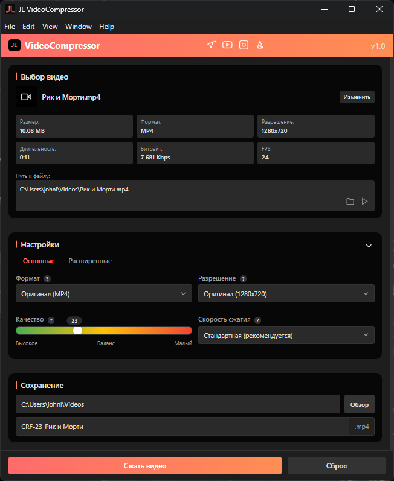
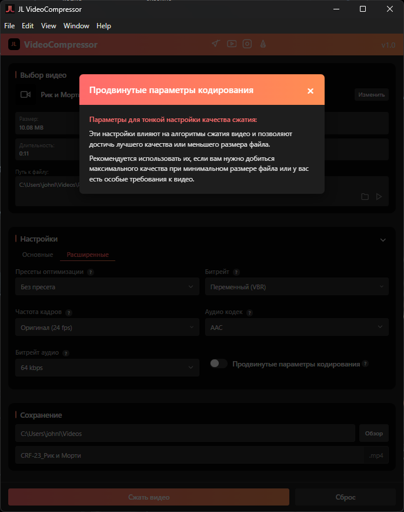
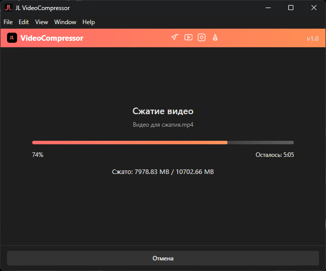
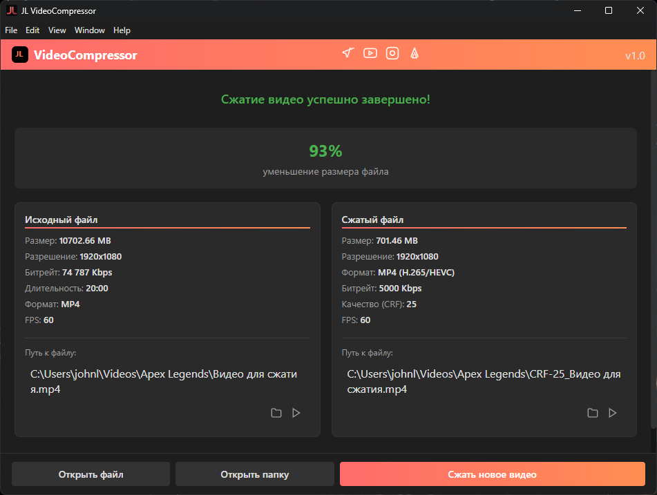

# JL-VideoCompressor

JL-VideoCompressor - мощное настольное приложение для сжатия видеофайлов с сохранением высокого качества. Приложение использует FFmpeg для оптимизации размера видеофайлов с гибкими настройками качества.



## Возможности

- Сжатие видео с настраиваемыми параметрами качества
- Поддержка различных форматов: MP4, AVI, MKV, MOV, WebM
- Выбор кодеков H.264, H.265/HEVC и VP9
- Регулируемое качество (CRF)
- Настройки разрешения и битрейта
- Продвинутые параметры кодирования
- Предустановки для различных сценариев использования
- Наглядная информация о прогрессе сжатия
- Сравнение исходного и сжатого файлов

## Скриншоты

### Главный интерфейс


### Настройки качества


### Прогресс сжатия


### Результаты сжатия


## Установка

### Предварительные требования
- Windows 7 или выше
- Node.js 14 или выше (для разработки)

### Установка готового приложения
1. Загрузите последнюю версию из раздела [Releases](https://github.com/John-LapTev/JL-VideoCompressor/releases)
2. Запустите установщик или распакуйте портативную версию

### Сборка из исходного кода
1. Клонируйте репозиторий
   ```
   git clone https://github.com/John-LapTev/JL-VideoCompressor.git
   cd JL-VideoCompressor
   ```

2. Запустите скрипт настройки
   ```
   setup.bat
   ```

3. Запустите приложение в режиме разработки
   ```
   dev.bat
   ```

4. Для сборки приложения используйте
   ```
   build.bat
   ```

## Разработка

### Структура проекта
```
JL-VideoCompressor/
├── src/                  # Исходный код
│   ├── main.js           # Основной процесс Electron
│   ├── preload.js        # Предзагрузочный скрипт
│   └── renderer/         # Файлы пользовательского интерфейса
│       ├── index.html    # HTML разметка
│       ├── script.js     # JavaScript для UI
│       ├── styles.css    # CSS стили
│       └── assets/       # Ресурсы (изображения, иконки)
├── resources/            # Ресурсы приложения
│   └── icons/            # Иконки приложения
├── build.bat             # Скрипт сборки
├── dev.bat               # Скрипт для режима разработки
├── setup.bat             # Скрипт настройки среды
├── fix-dependencies.bat  # Исправление зависимостей
└── package.json          # Описание проекта и зависимости
```

### Команды
- `setup.bat` - Настройка среды разработки
- `dev.bat` - Запуск в режиме разработки
- `build.bat` - Сборка приложения (portable и installer)
- `fix-dependencies.bat` - Исправление зависимостей в package.json

## Технологии
- [Electron](https://www.electronjs.org/) - фреймворк для создания настольных приложений
- [FFmpeg](https://ffmpeg.org/) - библиотека для обработки видео и аудио
- HTML/CSS/JavaScript - для пользовательского интерфейса

## Лицензия
Этот проект распространяется под лицензией MIT. Подробности в файле [LICENSE](LICENSE).

## Автор
- **JL** - [GitHub](https://github.com/John-LapTev)

## Социальные сети
- [Telegram](https://t.me/JL_Stable_Diffusion)
- [YouTube](https://youtube.com/@cheesez_crazy)
- [Instagram](http://instagram.com/john_laptev)
- [Boosty](https://boosty.to/jlsd)
